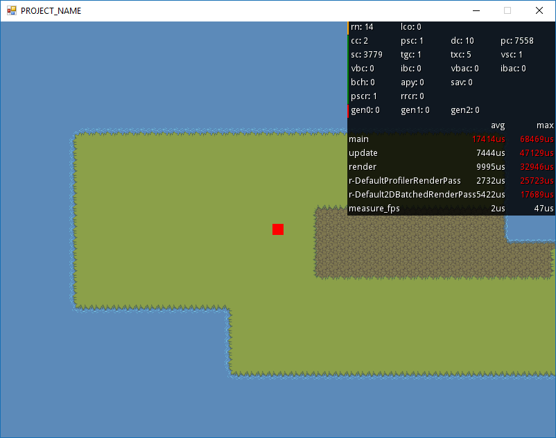

Protogame "Panning Camera" Template
================================

This template implements a 2D top-down game with a panning camera in Protogame.  It covers the following topics:

- How to load Ogmo editor levels
- How to define tileset assets
- How to use the 2D panning camera APIs
- How to perform 2D movement in a top-down world
- How to use the profiler APIs in Protogame

Getting Started
------------------

We'll be adding this template to the Protobuild Manager in the near future.  In the mean time, you can create this template from the command-line with:

```
Protobuild.exe --start https-git://www.github.com/RedpointGames/Protogame.Template.PanningCamera
```

Just download [Protobuild.exe](https://github.com/Protobuild/Protobuild/raw/master/Protobuild.exe) and place it in an empty folder where you want to create your project.

Screenshot
--------------


